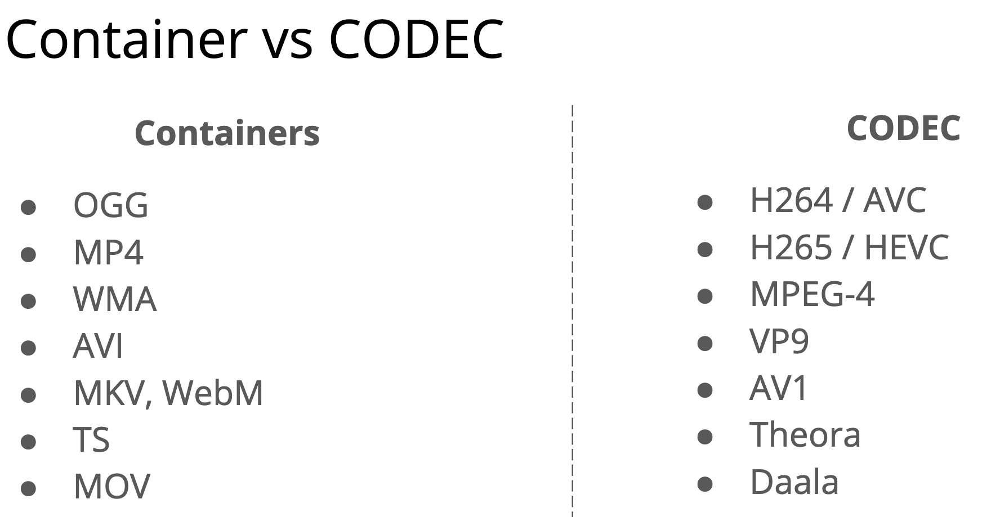
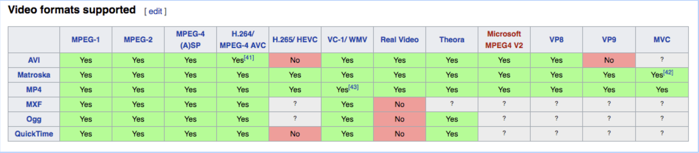

# Video Streaming Sources

## Adaptive bitrate streaming

* **Transcoding**, at a high level, is taking already-compressed (or encoded) content; decompressing (decoding) it; and then somehow altering and recompressing it. As an example, you might change the audio and/or video format (codec) from one to another, such as converting from an MPEG2 source (commonly used in broadcast television) to H.264 video and AAC audio (the most popular codecs for streaming). Other basic tasks could include adding watermarks, logos, or other graphics to your video.
* **Transrating** refers specifically to changing bitrates, such as taking a 4K video input stream at 13 Mbps and converting it into one or more lower-bitrate streams (also known as renditions): HD at 6Mbps, or other renditions at 3 Mbps, 1.8 Mbps, 1 Mbps, 600 kbps, etc.
* **Transsizing** refers specifically to resizing the video frame; say, from a resolution of 3840×2160 (4K UHD) down to 1920×1080 (1080p) or 1280×720 (720p).

## Bitrate

    WIDTH * HEIGHT * BITS_PER_PIXEL * FPS
    4 * 4 * 24 * 30
    11,520 bits per second

## Sources

1. [DeepDive Video Transcoding](https://www.youtube.com/channel/UCIc_DkRxo9UgUSTvWVNCmpA/videos)

1. [Ffmpg libav Tutorial](https://github.com/leandromoreira/ffmpeg-libav-tutorial)

    1. <http://slhck.info/ffmpeg-encoding-course/>
    1. <https://slhck.info/video/2017/02/24/crf-guide.html>

1. [How does a video codec work ?](https://github.com/leandromoreira/digital_video_introduction#how-does-a-video-codec-work)

1. [Definitive Workshop for video developers](https://docs.google.com/presentation/d/17Z31kEkl_NGJ0M66reqr9_uTG6tI5EDDVXpdPKVuIrs/edit#slide=id.g20b2cf43d7_0_290)

## CODECS VS Containers

